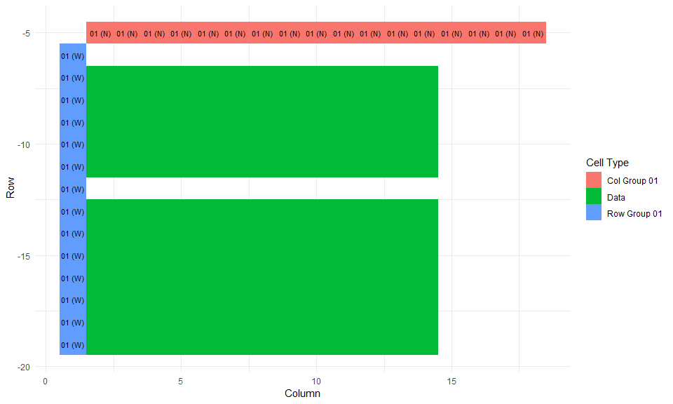

<!-- README.md is generated from README.Rmd. Please edit that file -->

## Overview

The TidyABS package converts excel sheets released by the Australian
Bureau of Statistics into a tidy data format. It can sometimes guess the
structure of the table and tidy without any hints, other times some
pointers are required from the user.

Note: Files must be saved as .xlsx files.

## Installation

TidyABS is not available on CRAN. The package can be installed from
github with the following script:

``` r
# install.packages("devtools")
devtools::install_github("ianmoran11/tidyABS")
```

## Usage

``` r
library(tidyABS)
library(tidyverse)
```

tidyABS includes several example files. Use the helper
`tidyABS_example()` with no arguments to list them or call it with an
example filename to get the path.

``` r
tidyABS_example()
#> [1] "~$time-use_gender-indicators.xlsx"   
#> [2] "australian-industry.xlsx"            
#> [3] "consumer-price-index.xlsx"           
#> [4] "employee-earnings-and-hours.xlsx"    
#> [5] "environmental-economic-accounts.xlsx"
#> [6] "motor-vehicle-use.xlsx"              
#> [7] "time-use_gender-indicators.xlsx"
```

### Example 1: Australian Industry

Here’s an excel workbook from the Australian release. We can get its
path by using the `tidyABS_example` with the the filename as an
argument:

``` r
ai_path <- tidyABS_example("australian-industry.xlsx")
```

We can now process the first sheet, “Table\_1”, of the file using the
function
`process_ABS_sheet`

``` r
ai_01_processed <-  process_ABS_sheet(path = ai_path, sheets = "Table_1") 

ai_01_processed %>% str(1)
#> List of 3
#>  $ col_groups:Classes 'tbl_df', 'tbl' and 'data.frame':  2 obs. of  10 variables:
#>  $ row_groups:Classes 'tbl_df', 'tbl' and 'data.frame':  2 obs. of  11 variables:
#>  $ tabledata :Classes 'tbl_df', 'tbl' and 'data.frame':  1816 obs. of  4 variables:
```

`mvu_01_processed` is a list of three dataframes. It stores the location
and format information of the cells that have been indentified as row
names (`row_groups`) and column names (`col_groups`). It also contains
the inner cell values of the table (`tabledata`).

We can inspect `mvu_01_processed` to see what values have been allocated
to which groups using the `inspect_table_components` function.

``` r
inspect_table_components(ai_01_processed)
#> $col_groups
#> $col_groups[[1]]
#> [1] "Employment at end of June"                                 
#> [2] "Wages and salaries"                                        
#> [3] "Sales and service income"                                  
#> [4] "Total income"                                              
#> [5] "Total expenses"                                            
#> [6] "Operating profit before tax"                               
#> [7] "Earnings before interest tax depreciation and amortisation"
#> [8] "Industry value added"                                      
#> 
#> $col_groups[[2]]
#> [1] "'000" "$m"  
#> 
#> 
#> $row_groups
#> $row_groups[[1]]
#>  [1] "2006–07" "2007–08" "2008–09" "2009–10" "2010–11" "2011–12" "2012–13"
#>  [8] "2013–14" "2014–15" "2015–16" "2016–17"
#> 
#> $row_groups[[2]]
#>  [1] "AGRICULTURE, FORESTRY AND FISHING"              
#>  [2] "MINING"                                         
#>  [3] "MANUFACTURING"                                  
#>  [4] "ELECTRICITY, GAS, WATER AND WASTE SERVICES"     
#>  [5] "CONSTRUCTION"                                   
#>  [6] "WHOLESALE TRADE"                                
#>  [7] "RETAIL TRADE"                                   
#>  [8] "ACCOMMODATION AND FOOD SERVICES"                
#>  [9] "TRANSPORT, POSTAL AND WAREHOUSING"              
#> [10] "INFORMATION MEDIA AND TELECOMMUNICATIONS"       
#> [11] "RENTAL, HIRING AND REAL ESTATE SERVICES"        
#> [12] "PROFESSIONAL, SCIENTIFIC AND TECHNICAL SERVICES"
#> [13] "ADMINISTRATIVE AND SUPPORT SERVICES"            
#> [14] "PUBLIC ADMINISTRATION AND SAFETY (PRIVATE)"     
#> [15] "EDUCATION AND TRAINING (PRIVATE)"               
#> [16] "HEALTH CARE AND SOCIAL ASSISTANCE (PRIVATE)"    
#> [17] "ARTS AND RECREATION SERVICES"                   
#> [18] "OTHER SERVICES"                                 
#> [19] "TOTAL SELECTED INDUSTRIES"                      
#> 
#> 
#> $tabledata
#> list()
```

Each of the groups listed will be given its own column in the resulting
tidy dataframe.

As you can see: + `col_group1` represents the measure associated with
the value in the table  
\+ `col_group2` represents the units of value in the table  
\+ `row_group1` represents the year associated with the value in the
table  
\+ `row_group2` industry associated with value in the table.

We can also can visually inspect how these groups are spatially layed
out in the spreadsheet any how tidyABS will relate them to table values
with `plot_table_components`.

``` r
plot_table_components(ai_01_processed) + ylim(-50,0)
```

<!-- -->

Finally, we can assembly the components into a tidy dataframe using
`assemble_table_components`.

``` r
assemble_table_components(ai_01_processed)
#> # A tibble: 1,816 x 8
#>     row   col comment value col_group_01 col_group_02 row_group_01
#>   <int> <int> <chr>   <chr> <chr>        <chr>        <chr>       
#> 1     8     2 <NA>    485   Employment ~ '000         2006–07     
#> 2     8     3 <NA>    5843  Wages and s~ $m           2006–07     
#> 3     8     4 <NA>    54410 Sales and s~ $m           2006–07     
#> # ... with 1,813 more rows, and 1 more variable: row_group_02 <chr>
```

All that is left to do is to rename columns are convert values to the
appropriate data types. Too easy\!

### Example 2: Environmental-Economic Accounts

Unfortunately it is not always easy.

Here’s an example proccess data from the Environmental Economic
Accounts. First, lets retrieve the path of our example file:

``` r
eea_path <- tidyABS_example("environmental-economic-accounts.xlsx")
```

Then sheet 1 (“Table 6.1”) of that file using the function
`process_ABS_sheet`

``` r
eea_01_processed <- process_ABS_sheet(path = eea_path, sheets = "Table 6.1")
```

On visual inspection, We can see some `row_group_01` has been given a
“W” orientation to the data, not “WNW”.

``` r
plot_table_components(eea_01_processed)
```

<!-- -->

Luckily, we can fix this with the `change_direction` function.

``` r
eea_01_processed <- 
  eea_01_processed %>% 
  change_direction("row_group_01","WNW")
```

Plotting the table shows that it as been corrected.

``` r
plot_table_components(eea_01_processed)
```

<!-- -->

Finally, we can assembly the components into a tidy dataframe using
`assemble_table_components`.

``` r
assemble_table_components(eea_01_processed)  
#> # A tibble: 156 x 8
#>     row   col comment value col_group_01 row_group_01 row_group_02
#>   <int> <int> <chr>   <chr> <chr>        <chr>        <chr>       
#> 1     7     2 <NA>    13532 2003–04      "Energy Tax~ <NA>        
#> 2     7     3 <NA>    14352 2004–05      "Energy Tax~ <NA>        
#> 3     7     4 <NA>    14075 2005–06      "Energy Tax~ <NA>        
#> # ... with 153 more rows, and 1 more variable: row_group_03 <chr>
```

### Example 3: Consumer Price Index (time series)

Time series data require the user to manually identify the inner table
cells. This is because some of the column groups are entered as numbers
— for example, collection month.

I recommend using the
[`readABS`](https://github.com/MattCowgill/readabs) package. This
package was built for process ABS time series data and does not require
any manual identifcation of table cells.

That said, here’s how you would do this with `tidyABS`.

``` r
cpi_path <- tidyABS_example("consumer-price-index.xlsx")
```

We need to identify the inner table cells using the
`manual_value_references` argument to `process_ABS_sheet`.This arguments
takes a vectors addresses, identifying the inner corners of the table.

``` r
cpi_processed <- 
  process_ABS_sheet(path = cpi_path, sheets = "Data1",
                    manual_value_references = c("B11","AB11","B292","AB292"))
```

And here is the resulting data frame.

``` r
inspect_table_components(cpi_processed)
#> $col_groups
#> $col_groups[[1]]
#>  [1] "Index Numbers ;  All groups CPI ;  Sydney ;"                                                   
#>  [2] "Index Numbers ;  All groups CPI ;  Melbourne ;"                                                
#>  [3] "Index Numbers ;  All groups CPI ;  Brisbane ;"                                                 
#>  [4] "Index Numbers ;  All groups CPI ;  Adelaide ;"                                                 
#>  [5] "Index Numbers ;  All groups CPI ;  Perth ;"                                                    
#>  [6] "Index Numbers ;  All groups CPI ;  Hobart ;"                                                   
#>  [7] "Index Numbers ;  All groups CPI ;  Darwin ;"                                                   
#>  [8] "Index Numbers ;  All groups CPI ;  Canberra ;"                                                 
#>  [9] "Index Numbers ;  All groups CPI ;  Australia ;"                                                
#> [10] "Percentage Change from Corresponding Quarter of Previous Year ;  All groups CPI ;  Sydney ;"   
#> [11] "Percentage Change from Corresponding Quarter of Previous Year ;  All groups CPI ;  Melbourne ;"
#> [12] "Percentage Change from Corresponding Quarter of Previous Year ;  All groups CPI ;  Brisbane ;" 
#> [13] "Percentage Change from Corresponding Quarter of Previous Year ;  All groups CPI ;  Adelaide ;" 
#> [14] "Percentage Change from Corresponding Quarter of Previous Year ;  All groups CPI ;  Perth ;"    
#> [15] "Percentage Change from Corresponding Quarter of Previous Year ;  All groups CPI ;  Hobart ;"   
#> [16] "Percentage Change from Corresponding Quarter of Previous Year ;  All groups CPI ;  Darwin ;"   
#> [17] "Percentage Change from Corresponding Quarter of Previous Year ;  All groups CPI ;  Canberra ;" 
#> [18] "Percentage Change from Corresponding Quarter of Previous Year ;  All groups CPI ;  Australia ;"
#> [19] "Percentage Change from Previous Period ;  All groups CPI ;  Sydney ;"                          
#> [20] "Percentage Change from Previous Period ;  All groups CPI ;  Melbourne ;"                       
#> [21] "Percentage Change from Previous Period ;  All groups CPI ;  Brisbane ;"                        
#> [22] "Percentage Change from Previous Period ;  All groups CPI ;  Adelaide ;"                        
#> [23] "Percentage Change from Previous Period ;  All groups CPI ;  Perth ;"                           
#> [24] "Percentage Change from Previous Period ;  All groups CPI ;  Hobart ;"                          
#> [25] "Percentage Change from Previous Period ;  All groups CPI ;  Darwin ;"                          
#> [26] "Percentage Change from Previous Period ;  All groups CPI ;  Canberra ;"                        
#> [27] "Percentage Change from Previous Period ;  All groups CPI ;  Australia ;"                       
#> 
#> $col_groups[[2]]
#> [1] "Index Numbers" "Percent"      
#> 
#> $col_groups[[3]]
#> [1] "Original"
#> 
#> $col_groups[[4]]
#> [1] "INDEX"   "PERCENT"
#> 
#> $col_groups[[5]]
#> [1] "Quarter"
#> 
#> $col_groups[[6]]
#> [1] "3"
#> 
#> $col_groups[[7]]
#> [1] "1948-09-01" "1980-09-01" "1949-09-01" "1981-09-01" "1948-12-01"
#> [6] "1980-12-01"
#> 
#> $col_groups[[8]]
#> [1] "2018-12-01"
#> 
#> $col_groups[[9]]
#> [1] "282" "154" "278" "150" "281" "153"
#> 
#> $col_groups[[10]]
#>  [1] "A2325806K" "A2325811C" "A2325816R" "A2325821J" "A2325826V"
#>  [6] "A2325831L" "A2325836X" "A2325841T" "A2325846C" "A2325807L"
#> [11] "A2325812F" "A2325817T" "A2325822K" "A2325827W" "A2325832R"
#> [16] "A2325837A" "A2325842V" "A2325847F" "A2325810A" "A2325815L"
#> [21] "A2325820F" "A2325825T" "A2325830K" "A2325835W" "A2325840R"
#> [26] "A2325845A" "A2325850V"
#> 
#> 
#> $row_groups
#> $row_groups[[1]]
#>   [1] "1948-09-01" "1948-12-01" "1949-03-01" "1949-06-01" "1949-09-01"
#>   [6] "1949-12-01" "1950-03-01" "1950-06-01" "1950-09-01" "1950-12-01"
#>  [11] "1951-03-01" "1951-06-01" "1951-09-01" "1951-12-01" "1952-03-01"
#>  [16] "1952-06-01" "1952-09-01" "1952-12-01" "1953-03-01" "1953-06-01"
#>  [21] "1953-09-01" "1953-12-01" "1954-03-01" "1954-06-01" "1954-09-01"
#>  [26] "1954-12-01" "1955-03-01" "1955-06-01" "1955-09-01" "1955-12-01"
#>  [31] "1956-03-01" "1956-06-01" "1956-09-01" "1956-12-01" "1957-03-01"
#>  [36] "1957-06-01" "1957-09-01" "1957-12-01" "1958-03-01" "1958-06-01"
#>  [41] "1958-09-01" "1958-12-01" "1959-03-01" "1959-06-01" "1959-09-01"
#>  [46] "1959-12-01" "1960-03-01" "1960-06-01" "1960-09-01" "1960-12-01"
#>  [51] "1961-03-01" "1961-06-01" "1961-09-01" "1961-12-01" "1962-03-01"
#>  [56] "1962-06-01" "1962-09-01" "1962-12-01" "1963-03-01" "1963-06-01"
#>  [61] "1963-09-01" "1963-12-01" "1964-03-01" "1964-06-01" "1964-09-01"
#>  [66] "1964-12-01" "1965-03-01" "1965-06-01" "1965-09-01" "1965-12-01"
#>  [71] "1966-03-01" "1966-06-01" "1966-09-01" "1966-12-01" "1967-03-01"
#>  [76] "1967-06-01" "1967-09-01" "1967-12-01" "1968-03-01" "1968-06-01"
#>  [81] "1968-09-01" "1968-12-01" "1969-03-01" "1969-06-01" "1969-09-01"
#>  [86] "1969-12-01" "1970-03-01" "1970-06-01" "1970-09-01" "1970-12-01"
#>  [91] "1971-03-01" "1971-06-01" "1971-09-01" "1971-12-01" "1972-03-01"
#>  [96] "1972-06-01" "1972-09-01" "1972-12-01" "1973-03-01" "1973-06-01"
#> [101] "1973-09-01" "1973-12-01" "1974-03-01" "1974-06-01" "1974-09-01"
#> [106] "1974-12-01" "1975-03-01" "1975-06-01" "1975-09-01" "1975-12-01"
#> [111] "1976-03-01" "1976-06-01" "1976-09-01" "1976-12-01" "1977-03-01"
#> [116] "1977-06-01" "1977-09-01" "1977-12-01" "1978-03-01" "1978-06-01"
#> [121] "1978-09-01" "1978-12-01" "1979-03-01" "1979-06-01" "1979-09-01"
#> [126] "1979-12-01" "1980-03-01" "1980-06-01" "1980-09-01" "1980-12-01"
#> [131] "1981-03-01" "1981-06-01" "1981-09-01" "1981-12-01" "1982-03-01"
#> [136] "1982-06-01" "1982-09-01" "1982-12-01" "1983-03-01" "1983-06-01"
#> [141] "1983-09-01" "1983-12-01" "1984-03-01" "1984-06-01" "1984-09-01"
#> [146] "1984-12-01" "1985-03-01" "1985-06-01" "1985-09-01" "1985-12-01"
#> [151] "1986-03-01" "1986-06-01" "1986-09-01" "1986-12-01" "1987-03-01"
#> [156] "1987-06-01" "1987-09-01" "1987-12-01" "1988-03-01" "1988-06-01"
#> [161] "1988-09-01" "1988-12-01" "1989-03-01" "1989-06-01" "1989-09-01"
#> [166] "1989-12-01" "1990-03-01" "1990-06-01" "1990-09-01" "1990-12-01"
#> [171] "1991-03-01" "1991-06-01" "1991-09-01" "1991-12-01" "1992-03-01"
#> [176] "1992-06-01" "1992-09-01" "1992-12-01" "1993-03-01" "1993-06-01"
#> [181] "1993-09-01" "1993-12-01" "1994-03-01" "1994-06-01" "1994-09-01"
#> [186] "1994-12-01" "1995-03-01" "1995-06-01" "1995-09-01" "1995-12-01"
#> [191] "1996-03-01" "1996-06-01" "1996-09-01" "1996-12-01" "1997-03-01"
#> [196] "1997-06-01" "1997-09-01" "1997-12-01" "1998-03-01" "1998-06-01"
#> [201] "1998-09-01" "1998-12-01" "1999-03-01" "1999-06-01" "1999-09-01"
#> [206] "1999-12-01" "2000-03-01" "2000-06-01" "2000-09-01" "2000-12-01"
#> [211] "2001-03-01" "2001-06-01" "2001-09-01" "2001-12-01" "2002-03-01"
#> [216] "2002-06-01" "2002-09-01" "2002-12-01" "2003-03-01" "2003-06-01"
#> [221] "2003-09-01" "2003-12-01" "2004-03-01" "2004-06-01" "2004-09-01"
#> [226] "2004-12-01" "2005-03-01" "2005-06-01" "2005-09-01" "2005-12-01"
#> [231] "2006-03-01" "2006-06-01" "2006-09-01" "2006-12-01" "2007-03-01"
#> [236] "2007-06-01" "2007-09-01" "2007-12-01" "2008-03-01" "2008-06-01"
#> [241] "2008-09-01" "2008-12-01" "2009-03-01" "2009-06-01" "2009-09-01"
#> [246] "2009-12-01" "2010-03-01" "2010-06-01" "2010-09-01" "2010-12-01"
#> [251] "2011-03-01" "2011-06-01" "2011-09-01" "2011-12-01" "2012-03-01"
#> [256] "2012-06-01" "2012-09-01" "2012-12-01" "2013-03-01" "2013-06-01"
#> [261] "2013-09-01" "2013-12-01" "2014-03-01" "2014-06-01" "2014-09-01"
#> [266] "2014-12-01" "2015-03-01" "2015-06-01" "2015-09-01" "2015-12-01"
#> [271] "2016-03-01" "2016-06-01" "2016-09-01" "2016-12-01" "2017-03-01"
#> [276] "2017-06-01" "2017-09-01" "2017-12-01" "2018-03-01" "2018-06-01"
#> [281] "2018-09-01" "2018-12-01"
#> 
#> 
#> $tabledata
#> list()

assemble_table_components(cpi_processed) 
#> # A tibble: 7,185 x 15
#>     row   col comment value col_group_01 col_group_02 col_group_03
#>   <int> <int> <chr>   <chr> <chr>        <chr>        <chr>       
#> 1    11     2 <NA>    3.7   Index Numbe~ Index Numbe~ Original    
#> 2    11     3 <NA>    3.8   Index Numbe~ Index Numbe~ Original    
#> 3    11     4 <NA>    3.7   Index Numbe~ Index Numbe~ Original    
#> # ... with 7,182 more rows, and 8 more variables: col_group_04 <chr>,
#> #   col_group_05 <chr>, col_group_06 <chr>, col_group_07 <chr>,
#> #   col_group_08 <chr>, col_group_09 <chr>, col_group_10 <chr>,
#> #   row_group_01 <chr>
```
