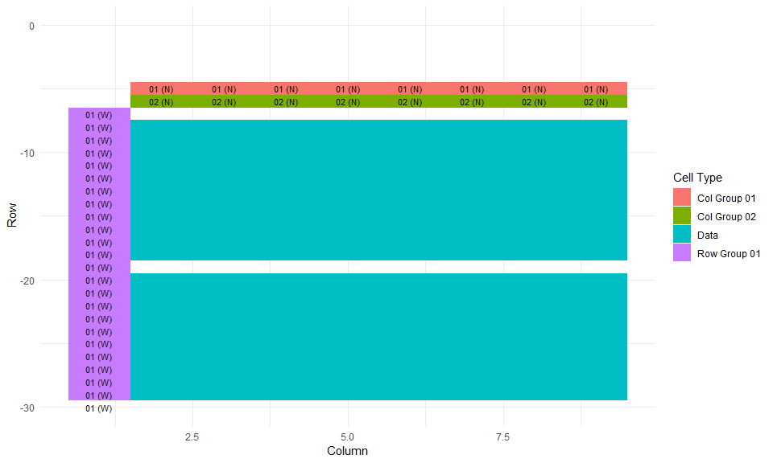
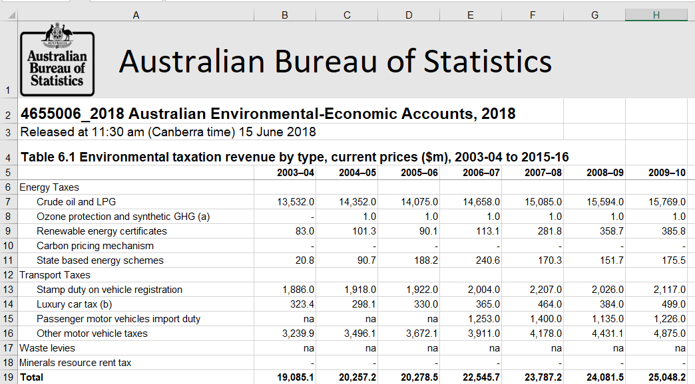

<!-- README.md is generated from README.Rmd. Please edit that file -->

## Overview

The TidyABS package converts ABS excel sheets into a tidy dataframes. It
can often guess the structure of the excel table using heuristics and
tidy without any hints from the user, however sometimes pointers are
necessary.

*Note: tidyABS works with .xlsx files only. ABS files are often in .xls
format, so conversion is required.*

## Installation

TidyABS is not available on CRAN. The package can be installed from
github with the following script:

``` r
# install.packages("devtools")
devtools::install_github("ianmoran11/tidyABS")
```

## Usage

``` r
library(tidyABS)
library(tidyverse)
```

Below is a quick demonstration that tidies an Australian Industry sheet.

``` r
tidyABS_example("australian-industry.xlsx") %>% 
  process_ABS_sheet(sheets = "Table_1") %>% 
  assemble_table_components()  %>% 
  glimpse
#> Observations: 1,816
#> Variables: 8
#> $ row          <int> 8, 8, 8, 8, 8, 8, 8, 8, 9, 9, 9, 9, 9, 9, 9, 9, 1...
#> $ col          <int> 2, 3, 4, 5, 6, 7, 8, 9, 2, 3, 4, 5, 6, 7, 8, 9, 2...
#> $ comment      <chr> NA, NA, NA, NA, NA, "estimate has a relative stan...
#> $ value        <chr> "485", "5843", "54410", "57577", "52046", "5461",...
#> $ col_group_01 <chr> "Employment at end of June", "Wages and salaries"...
#> $ col_group_02 <chr> "'000", "$m", "$m", "$m", "$m", "$m", "$m", "$m",...
#> $ row_group_01 <chr> "2006–07", "2006–07", "2006–07", "2006–07", "2006...
#> $ row_group_02 <chr> "AGRICULTURE, FORESTRY AND FISHING", "AGRICULTURE...
```

More functionality of the tidyABS is presented below.

### Example 1: Australian Industry

<!-- -->

tidyABS includes several example files. Use the helper
`tidyABS_example()` with no arguments to list these files:

``` r
tidyABS_example()
#> [1] "australian-industry.xlsx"            
#> [2] "consumer-price-index.xlsx"           
#> [3] "environmental-economic-accounts.xlsx"
```

Here’s the first sheet of an excel workbook from the Australian Industry
publication. We can retrieve the path of this file using the
`tidyABS_example` function with our filename as the argument:

``` r
ai_path <- tidyABS_example("australian-industry.xlsx")
```

We can now process `Table_1` (the first sheet of the workbook) using the
`process_ABS_sheet` function.

``` r
ai_processed <-  process_ABS_sheet(path = ai_path, sheets = "Table_1") 

ai_processed %>% str(1)
#> List of 3
#>  $ col_groups:Classes 'tbl_df', 'tbl' and 'data.frame':  2 obs. of  10 variables:
#>  $ row_groups:Classes 'tbl_df', 'tbl' and 'data.frame':  2 obs. of  11 variables:
#>  $ tabledata :Classes 'tbl_df', 'tbl' and 'data.frame':  1816 obs. of  4 variables:
```

As you can see `ai_processed` is a list of three dataframes. It stores
the location and format information of row names (`row_groups`) and
column names (`col_groups`) inner cell values of the table
(`tabledata`).

We can inspect `ai_processed` to see what values have been classified as
row and column cells using the `inspect_table_components` function.

``` r
inspect_table_components(ai_processed)
#> $col_groups
#> $col_groups[[1]]
#> [1] "Employment at end of June"                                 
#> [2] "Wages and salaries"                                        
#> [3] "Sales and service income"                                  
#> [4] "Total income"                                              
#> [5] "Total expenses"                                            
#> [6] "Operating profit before tax"                               
#> [7] "Earnings before interest tax depreciation and amortisation"
#> [8] "Industry value added"                                      
#> 
#> $col_groups[[2]]
#> [1] "'000" "$m"  
#> 
#> 
#> $row_groups
#> $row_groups[[1]]
#>  [1] "2006–07" "2007–08" "2008–09" "2009–10" "2010–11" "2011–12" "2012–13"
#>  [8] "2013–14" "2014–15" "2015–16" "2016–17"
#> 
#> $row_groups[[2]]
#>  [1] "AGRICULTURE, FORESTRY AND FISHING"              
#>  [2] "MINING"                                         
#>  [3] "MANUFACTURING"                                  
#>  [4] "ELECTRICITY, GAS, WATER AND WASTE SERVICES"     
#>  [5] "CONSTRUCTION"                                   
#>  [6] "WHOLESALE TRADE"                                
#>  [7] "RETAIL TRADE"                                   
#>  [8] "ACCOMMODATION AND FOOD SERVICES"                
#>  [9] "TRANSPORT, POSTAL AND WAREHOUSING"              
#> [10] "INFORMATION MEDIA AND TELECOMMUNICATIONS"       
#> [11] "RENTAL, HIRING AND REAL ESTATE SERVICES"        
#> [12] "PROFESSIONAL, SCIENTIFIC AND TECHNICAL SERVICES"
#> [13] "ADMINISTRATIVE AND SUPPORT SERVICES"            
#> [14] "PUBLIC ADMINISTRATION AND SAFETY (PRIVATE)"     
#> [15] "EDUCATION AND TRAINING (PRIVATE)"               
#> [16] "HEALTH CARE AND SOCIAL ASSISTANCE (PRIVATE)"    
#> [17] "ARTS AND RECREATION SERVICES"                   
#> [18] "OTHER SERVICES"                                 
#> [19] "TOTAL SELECTED INDUSTRIES"                      
#> 
#> 
#> $tabledata
#> list()
```

We can also can visually inspect how these groups are spatially layed
out in the spreadsheet any how tidyABS will relate them to table values
with `plot_table_components`.

``` r
plot_table_components(ai_processed) + 
  ylim(-30,0) 
```

<!-- -->

Finally, we can assembly the components into a tidy dataframe using
`assemble_table_components`.

``` r
assemble_table_components(ai_processed) %>% 
  glimpse
#> Observations: 1,816
#> Variables: 8
#> $ row          <int> 8, 8, 8, 8, 8, 8, 8, 8, 9, 9, 9, 9, 9, 9, 9, 9, 1...
#> $ col          <int> 2, 3, 4, 5, 6, 7, 8, 9, 2, 3, 4, 5, 6, 7, 8, 9, 2...
#> $ comment      <chr> NA, NA, NA, NA, NA, "estimate has a relative stan...
#> $ value        <chr> "485", "5843", "54410", "57577", "52046", "5461",...
#> $ col_group_01 <chr> "Employment at end of June", "Wages and salaries"...
#> $ col_group_02 <chr> "'000", "$m", "$m", "$m", "$m", "$m", "$m", "$m",...
#> $ row_group_01 <chr> "2006–07", "2006–07", "2006–07", "2006–07", "2006...
#> $ row_group_02 <chr> "AGRICULTURE, FORESTRY AND FISHING", "AGRICULTURE...
```

All that is left to do is to rename columns are convert values to the
appropriate data types.

### Example 2: Environmental-Economic Accounts

<!-- -->

Here’s an example that requires some manual work, the Environmental
Economic Accounts. Let’s retrieve the path of our example file and
proces it:

``` r
eea_path <- tidyABS_example("environmental-economic-accounts.xlsx")

eea_processed <- process_ABS_sheet(path = eea_path, sheets = "Table 6.1")
```

On visual inspection, We can see `row_group_01` has been given a “W”
orientation to the data, not “WNW”.

``` r
plot_table_components(eea_processed)
```

<!-- -->

Luckily, we can fix this with the `change_direction` function.

``` r
eea_processed <- 
  eea_processed %>% 
  change_direction("row_group_01","WNW")
```

Plotting the table confirms the direction has been corrected.

``` r
plot_table_components(eea_processed)
```

<!-- -->

Finally, we can assembly the components into a tidy dataframe using
`assemble_table_components`.

``` r
assemble_table_components(eea_processed)   %>% 
  glimpse
#> Observations: 156
#> Variables: 8
#> $ row          <int> 7, 7, 7, 7, 7, 7, 7, 7, 7, 7, 7, 7, 7, 8, 8, 8, 8...
#> $ col          <int> 2, 3, 4, 5, 6, 7, 8, 9, 10, 11, 12, 13, 14, 2, 3,...
#> $ comment      <chr> NA, NA, NA, NA, NA, NA, NA, NA, NA, NA, NA, NA, N...
#> $ value        <chr> "13532", "14352", "14075", "14658", "15085", "155...
#> $ col_group_01 <chr> "2003–04", "2004–05", "2005–06", "2006–07", "2007...
#> $ row_group_01 <chr> "Energy Taxes ", "Energy Taxes ", "Energy Taxes "...
#> $ row_group_02 <chr> NA, NA, NA, NA, NA, NA, NA, NA, NA, NA, NA, NA, N...
#> $ row_group_03 <chr> "Crude oil and LPG", "Crude oil and LPG", "Crude ...
```

### Example 3: Consumer Price Index (time series)

<!-- -->

Time series data require the user to manually identify the inner table
cells. This is because some of the column groups are entered as numbers
— for example, collection month.

I recommend using the
[`readABS`](https://github.com/MattCowgill/readabs) package. This
package was built for importing ABS time series data and does not
require any manual identifcation of table cells.

That said, here’s how you would do this with `tidyABS`.

``` r
cpi_path <- tidyABS_example("consumer-price-index.xlsx")
```

We need to identify the inner table cells using the
`manual_value_references` argument to `process_ABS_sheet`.This arguments
takes a vectors addresses, identifying the inner corners of the table.

``` r
cpi_processed <- 
  process_ABS_sheet(path = cpi_path, sheets = "Data1",
                    manual_value_references = c("B11","AB11","B292","AB292"))
```

And here is the resulting data frame.

``` r
assemble_table_components(cpi_processed)   %>% 
  glimpse
#> Observations: 7,185
#> Variables: 15
#> $ row          <int> 11, 11, 11, 11, 11, 11, 11, 11, 12, 12, 12, 12, 1...
#> $ col          <int> 2, 3, 4, 5, 6, 7, 9, 10, 2, 3, 4, 5, 6, 7, 9, 10,...
#> $ comment      <chr> NA, NA, NA, NA, NA, NA, NA, NA, NA, NA, NA, NA, N...
#> $ value        <chr> "3.7", "3.8", "3.7", "3.8", "3.7", "3.8", "3.9", ...
#> $ col_group_01 <chr> "Index Numbers ;  All groups CPI ;  Sydney ;", "I...
#> $ col_group_02 <chr> "Index Numbers", "Index Numbers", "Index Numbers"...
#> $ col_group_03 <chr> "Original", "Original", "Original", "Original", "...
#> $ col_group_04 <chr> "INDEX", "INDEX", "INDEX", "INDEX", "INDEX", "IND...
#> $ col_group_05 <chr> "Quarter", "Quarter", "Quarter", "Quarter", "Quar...
#> $ col_group_06 <chr> "3", "3", "3", "3", "3", "3", "3", "3", "3", "3",...
#> $ col_group_07 <chr> "1948-09-01", "1948-09-01", "1948-09-01", "1948-0...
#> $ col_group_08 <chr> "2018-12-01", "2018-12-01", "2018-12-01", "2018-1...
#> $ col_group_09 <chr> "282", "282", "282", "282", "282", "282", "282", ...
#> $ col_group_10 <chr> "A2325806K", "A2325811C", "A2325816R", "A2325821J...
#> $ row_group_01 <chr> "1948-09-01", "1948-09-01", "1948-09-01", "1948-0...
```
