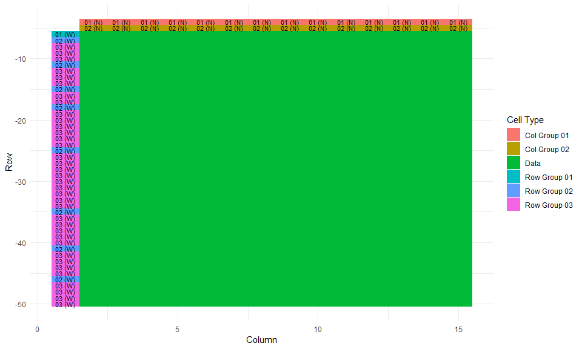
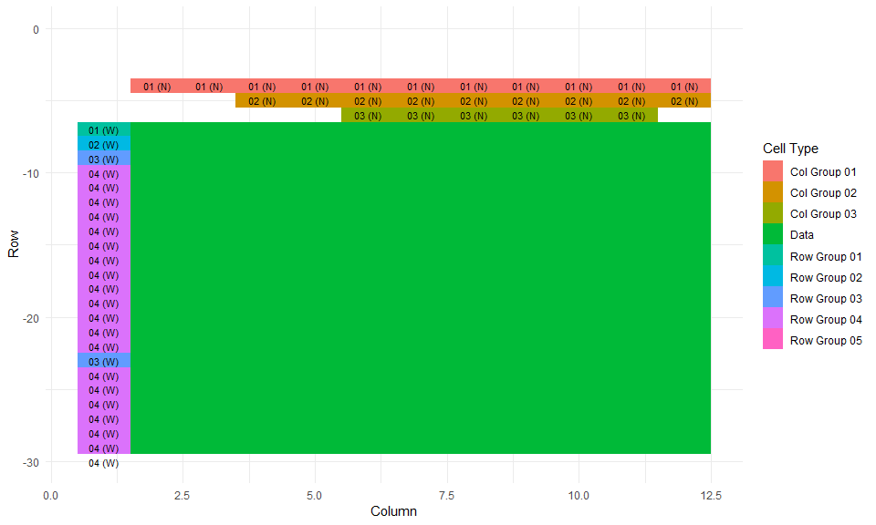

<!-- README.md is generated from README.Rmd. Please edit that file -->

## Tidying excel sheets from The Survey of Earned Doctorates

Here are a couple of examples using tidyABS on a non-ABS excel
table.

#### Table 12. Doctorate recipients, by major field of study: Selected years, 1987–2017

##### Minimal code

Here’s a mininal example.

``` r
tidyABS_example("PhD_major-field.xlsx") %>%
  process_ABS_sheet(path = ., sheets = 1, manual_value_references = "B6:O50") %>%
  change_direction("row_group_01", "WNW") %>%
  change_direction("row_group_02", "WNW") %>%
  assemble_table_components() %>%
  str()
#> Classes 'tbl_df', 'tbl' and 'data.frame':    630 obs. of  9 variables:
#>  $ row         : int  6 6 6 6 6 6 6 6 6 6 ...
#>  $ col         : int  2 3 4 5 6 7 8 9 10 11 ...
#>  $ comment     : chr  NA NA NA NA ...
#>  $ value       : chr  "32365" "100" "38886" "100" ...
#>  $ col_group_01: chr  "1987" "1987" "1992" "1992" ...
#>  $ col_group_02: chr  "Number" "Percent" "Number" "Percent" ...
#>  $ row_group_01: chr  "All fields" "All fields" "All fields" "All fields" ...
#>  $ row_group_02: chr  NA NA NA NA ...
#>  $ row_group_03: chr  NA NA NA NA ...
```

##### Step-through

First, read in the sheet, specifying table corners.

``` r
phd_field_df_components <-
  tidyABS_example("PhD_major-field.xlsx") %>%
  process_ABS_sheet(path = ., sheets = 1, manual_value_references = "B6:O50")
```

Check the orietation of cells and make corrections.

``` r
phd_field_df_components %>% plot_table_components()
```

<!-- -->

``` r

phd_field_df_components <-
  phd_field_df_components %>%
  change_direction("row_group_01", "WNW") %>%
  change_direction("row_group_02", "WNW")
```

Check the orietation of cells and make corrections.

``` r
phd_field_df <-
  phd_field_df_components %>%
  assemble_table_components()

phd_field_df %>% glimpse()
#> Observations: 630
#> Variables: 9
#> $ row          <int> 6, 6, 6, 6, 6, 6, 6, 6, 6, 6, 6, 6, 6, 6, 7, 7, 7...
#> $ col          <int> 2, 3, 4, 5, 6, 7, 8, 9, 10, 11, 12, 13, 14, 15, 2...
#> $ comment      <chr> NA, NA, NA, NA, NA, NA, NA, NA, NA, NA, NA, NA, N...
#> $ value        <chr> "32365", "100", "38886", "100", "42539", "100", "...
#> $ col_group_01 <chr> "1987", "1987", "1992", "1992", "1997", "1997", "...
#> $ col_group_02 <chr> "Number", "Percent", "Number", "Percent", "Number...
#> $ row_group_01 <chr> "All fields", "All fields", "All fields", "All fi...
#> $ row_group_02 <chr> NA, NA, NA, NA, NA, NA, NA, NA, NA, NA, NA, NA, N...
#> $ row_group_03 <chr> NA, NA, NA, NA, NA, NA, NA, NA, NA, NA, NA, NA, N...
```

#### Table 22. Doctorate recipients, by subfield of study, citizenship status, ethnicity, and race: 2017

##### Minimal code

Here’s a mininal
example.

``` r
tidyABS_example("PhD_ subfield-citizenship-status-ethnicity-race.xlsx") %>%
  process_ABS_sheet(path = ., sheets = 1, manual_value_references = "B7:L277") %>%
  change_direction("row_group_01", "WNW") %>%
  change_direction("row_group_02", "WNW") %>%
  change_direction("row_group_03", "WNW") %>%
  assemble_table_components() %>%
  glimpse()
#> Observations: 2,981
#> Variables: 12
#> $ row          <int> 7, 7, 7, 7, 7, 7, 7, 7, 7, 7, 7, 8, 8, 8, 8, 8, 8...
#> $ col          <int> 2, 3, 4, 5, 6, 7, 8, 9, 10, 11, 12, 2, 3, 4, 5, 6...
#> $ comment      <chr> NA, NA, NA, NA, NA, NA, NA, NA, NA, NA, NA, NA, N...
#> $ value        <chr> "54664", "16323", "35791", "2540", "109", "3502",...
#> $ col_group_01 <chr> "All doctorate recipientsa", "Temporary visa hold...
#> $ col_group_02 <chr> NA, NA, "Total", "Hispanic or Latino", "Not Hispa...
#> $ col_group_03 <chr> NA, NA, NA, NA, "American Indian or Alaska Native...
#> $ row_group_01 <chr> "All fields", "All fields", "All fields", "All fi...
#> $ row_group_02 <chr> NA, NA, NA, NA, NA, NA, NA, NA, NA, NA, NA, "Life...
#> $ row_group_03 <chr> NA, NA, NA, NA, NA, NA, NA, NA, NA, NA, NA, NA, N...
#> $ row_group_04 <chr> NA, NA, NA, NA, NA, NA, NA, NA, NA, NA, NA, NA, N...
#> $ row_group_05 <chr> NA, NA, NA, NA, NA, NA, NA, NA, NA, NA, NA, NA, N...
```

##### Step-through

First, read in the sheet, specifying table corners.

``` r
phd_background_components <-
  tidyABS_example("PhD_ subfield-citizenship-status-ethnicity-race.xlsx") %>%
  process_ABS_sheet(path = ., sheets = 1, manual_value_references = "B7:L277")
```

Check the orietation of cells and make corrections.

``` r
phd_background_components %>% plot_table_components() + ylim(-30, 0)
```

<!-- -->

``` r

phd_background_components <-
  phd_background_components %>%
  change_direction("row_group_01", "WNW") %>%
  change_direction("row_group_02", "WNW") %>%
  change_direction("row_group_03", "WNW")
```

Check the orietation of cells and make corrections.

``` r
phd_background_df <-
  phd_background_components %>%
  assemble_table_components()
```
